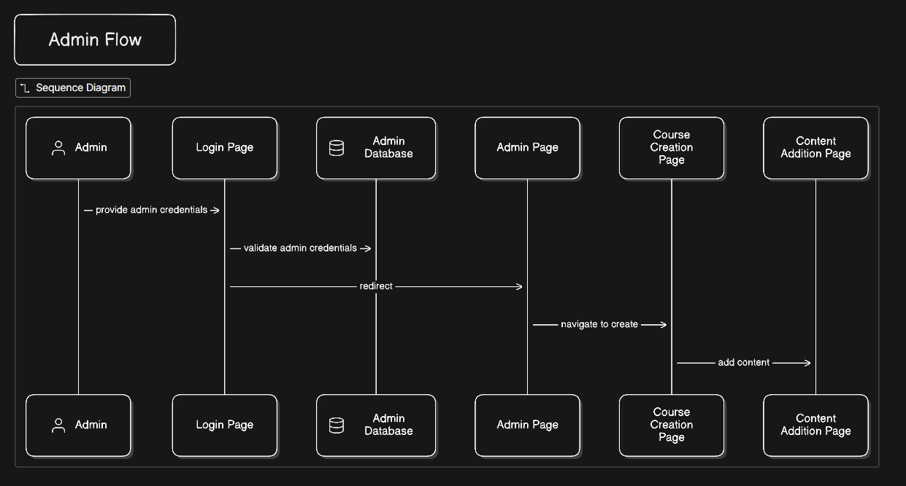

# What's inside?

Please refer [Edunoww-Upgrade](https://github.com/mohith0407/edunoww-upgrade) repo as i created the new repo and added all features
---
# 🎓 EduNoww – Learning Management System (LMS)

**EduNoww** is a scalable Learning Management System built on the **MERN Stack**. It is designed to bridge the gap between instructors and students through a seamless, interactive course delivery platform.

---

## Tech Stack

| Domain | Technologies |
| :--- | :--- |
| **Frontend** | React.js, Tailwind CSS, Vite |
| **Backend** | Node.js, Express.js |
| **Database** | MongoDB (Mongoose) |
| **State Management** | Redux Toolkit |
| **Auth** | JWT (JSON Web Tokens) |

---

## Application Workflow

### 1. User Flow
The student journey from authentication to content consumption.


### 2. Admin Flow
The administrative process for secure login, dashboard navigation, and course content creation.


---

## 📂 Project Architecture

```text
edunoww-app/
│
├── client/                     # Frontend Application (React + Vite)
│   ├── public/                 # Static assets
│   ├── src/
│   │   ├── Components/         # Reusable UI elements (Buttons, Cards)
│   │   ├── Layout/             # Structural components (Navbar, Sidebar)
│   │   ├── Pages/              # Page-level views (Login, Dashboard)
│   │   ├── Redux/              # Global State (Slices & Store)
│   │   ├── Helpers/            # Utilities (Formatters, Validators)
│   │   └── Constants/          # App-wide static strings/configs
│   └── [Config Files]          # Tailwind, Vite, & PostCSS configs
│
└── server/                     # Backend API (Node + Express)
    ├── config/                 # Database connection & Env setup
    ├── models/                 # Mongoose Schemas (User, Course)
    ├── routes/                 # API Endpoint definitions
    ├── controllers/            # Business logic & Request handling
    ├── middleware/             # Auth checks, Error handling, Multer
    ├── utils/                  # Helper modules (Emailer, Error Class)
    └── server.js               # Entry point
```
## Objectives

- Centralize online education for students
- Streamline scheduling and access to learning materials
- Offer an engaging and scalable educational platform

---

## Future Enhancements

- Student-instructor interaction
- chatBot system
- More personalised UI

---

## Conclusion

**EduNoww App** provides an effective solution for digital learning, combining robust backend support with a user-friendly frontend. It aims to be a scalable and impactful LMS platform.
